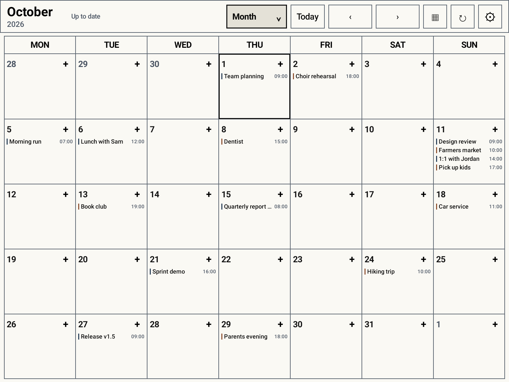
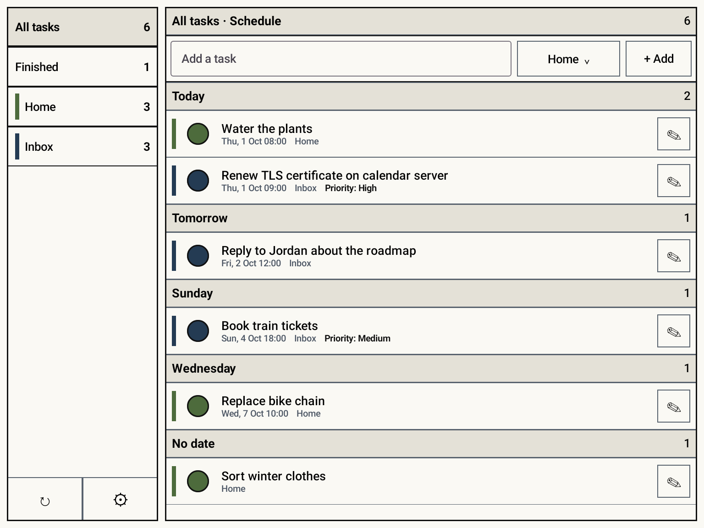
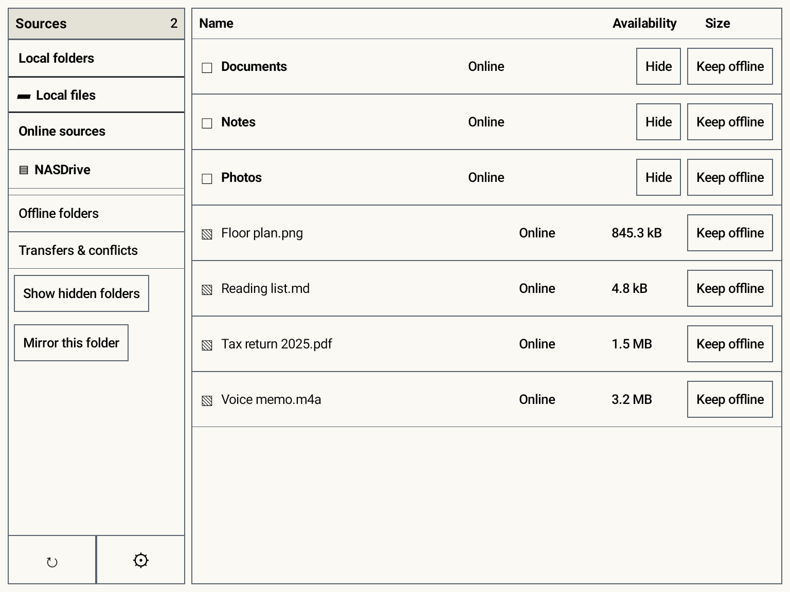
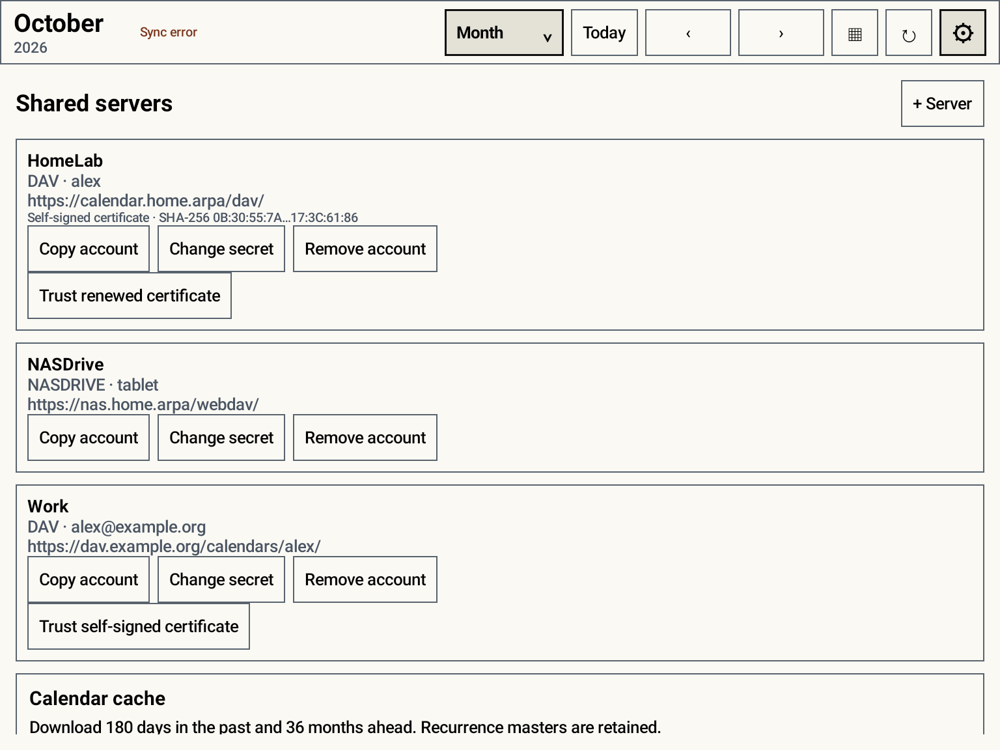

# InkDAV applications

InkDAV is a suite of four offline-first Android applications designed for large e-ink tablets, with the BOOX Note Air 5 C as its primary target:

- **InkDAV Calendar** — CalDAV events, calendar views, and the calendar widget (`de.tobisk.inkdav`).
- **InkDAV Todos** — VTODO lists, schedules, editing, and the todo widget (`de.tobisk.inkdav.todos`).
- **InkDAV Files** — NASDrive/WebDAV browsing, previews, mirrors, and Android DocumentsProvider access (`de.tobisk.inkdav.files`).
- **InkVault** — an Obsidian-compatible Markdown, PDF, audio, and handwriting workspace (`de.tobisk.inkvault`).

Each application has its own local feature cache and sync schedule. Server Setup is shared across the suite: server additions, credential changes, copies, and removals are replicated to the other installed applications through a signature-protected Android provider. Apps signed by another key cannot read it. Calendar keeps the original InkDAV package ID so an existing installation upgrades in place and supplies its configured servers to newly installed Todos and Files apps.

The UI uses opaque paper-colored surfaces, strong outlines, redundant text status, and page-style navigation. It intentionally avoids shadows, gradients, animated transitions, continuously moving indicators, and color-only state.

## Screenshots

| Calendar | Todos |
| --- | --- |
|  |  |
| **Files** | **Shared servers** |
|  |  |

The screenshots are rendered from the real app with demo data by a Robolectric/Roborazzi test. Regenerate them with:

```sh
./gradlew recordRoborazziCalendarDebug recordRoborazziTodosDebug recordRoborazziFilesDebug --tests '*ReadmeScreenshotTest*'
```

## Self-signed servers

When adding a server, tick **Server uses a self-signed certificate**. InkDAV opens a TLS connection without sending credentials, shows the certificate's subject, issuer, expiry, and SHA-256 fingerprint, and stores only that fingerprint once you choose **Trust and save**. Compare it with the fingerprint on your server first, for example `openssl x509 -noout -fingerprint -sha256 -in cert.pem`. Only that exact certificate is accepted in addition to Android's normal trust store; TLS verification is never disabled. After the certificate is renewed, use **Trust renewed certificate** in the server settings. Servers that fail with an untrusted certificate offer **Trust self-signed certificate** there as well.

## InkVault (in development)

The separate `:inkvault` Android app implements an initial offline Obsidian vault,
Markdown and handwriting workspace. It is not a completed implementation of the
handwriting app plan. Source/PDF pairing is implemented in the companion
[ObsidiSync server patch](docs/obsidisync-inkvault-notes-v1.patch); handwriting
sync requires that updated server.
See [implementation and acceptance status](docs/INKVAULT_IMPLEMENTATION.md) for
features, known gaps, builds and verification. Its package is `de.tobisk.inkvault`
and its release artifacts use `InkVault-vVERSION-boox-note-air5c.apk`.

## Current vertical slice

- Multiple DAV and NASDrive accounts with Android Keystore-encrypted credentials.
- CalDAV collection discovery, bounded initial event download, RFC 6578 incremental sync and guarded deletion tombstones across multiple calendars.
- Offline event create/edit/delete with materialized RRULE/RDATE/EXDATE projections, detached changes/cancellations, `THISANDFUTURE`, and DST-safe date arithmetic.
- VTODO collection discovery, complete task download including undated and recurring tasks, multiple lists, offline create/edit/delete/completion, and Apple Reminders-style list/schedule views.
- Year, month, week, and agenda-style day calendar views.
- Room as the only UI-facing source of truth, with a durable mutation outbox.
- Immediate full synchronization plus hourly connected calendar/task synchronization with exponential retry; periodic work does not crawl file roots or wake the NAS.
- `If-None-Match`/`If-Match` writes, stopped conflict retries, and explicit “Use server” / “Keep both” resolution.
- WebDAV file indexing, nested folder navigation, pinned recursive folders, and streaming downloads.
- A separate local file browser rooted in either a user-selected Android folder or, after explicit all-files authorization, the shared device-storage root, with folder navigation, file-type icons, in-app Markdown/image/audio/first-page PDF previews, and external-app opening for every file.
- Two-way, three-way-baselined synchronization between a DAV folder and a user-selected Android Storage Access Framework folder, with safe first merge, rename propagation, pause/remove management, duplicate-binding prevention, conditional writes, conflict copies, atomic local downloads, and independent 10,000-item local/remote scan bounds.
- Android `DocumentsProvider` integration so other apps can browse indexed files and open cached or streamed content through the system file picker.
- Resizable task and calendar home-screen widgets. Task widgets can show one selected list or an upcoming window of 1–30 days while excluding selected lists; calendar widgets show the next occurrences. Row counts adapt to launcher-selected widget height.
- Adjustable past/future calendar cache window and e-ink settings.
- A Settings updater that checks official GitHub releases, verifies the APK checksum and signing identity, and opens Android's installer.

## Build

Requirements: JDK 17 and Android SDK platform 36.

```sh
JAVA_HOME=/path/to/jdk17 ANDROID_HOME=/path/to/android-sdk ./gradlew \
  testCalendarDebugUnitTest testTodosDebugUnitTest testFilesDebugUnitTest \
  :inkvault:testDebugUnitTest :inkvault:verifyBooxDependencies \
  assembleDebug assembleRelease
```

Canonical development checks:

```sh
./gradlew ktlintFormat
./gradlew ktlintCheck testCalendarDebugUnitTest testTodosDebugUnitTest testFilesDebugUnitTest \
  :inkvault:testDebugUnitTest :inkvault:verifyBooxDependencies \
  lintCalendarDebug lintTodosDebug lintFilesDebug :inkvault:lintDebug \
  assembleDebug assembleRelease
sh ./scripts/verify-ci-apks.sh
```

GitHub Actions runs formatting, JVM tests, debug/release lint, debug and minified release builds, Room migration and DAV contract tests on an Android 15 emulator, CodeQL, and an explicit BOOX compatibility check. Every successful main-branch run retains an installable debug APK for the Note Air5 C. A successful push run then gates the signed semantic-release transaction; see [docs/RELEASING.md](docs/RELEASING.md).

The local debug APKs are written to:

- `app/build/outputs/apk/calendar/debug/app-calendar-debug.apk`
- `app/build/outputs/apk/todos/debug/app-todos-debug.apk`
- `app/build/outputs/apk/files/debug/app-files-debug.apk`

Hosted releases provide matching `InkDAV-Calendar`, `InkDAV-Todos`, `InkDAV-Files`, and `InkVault` signed universal APKs with ARM64 native libraries for the Android 15 Note Air5 C.

To install on a USB- or network-ADB-connected BOOX tablet:

```sh
ANDROID_HOME=/path/to/android-sdk "$ANDROID_HOME/platform-tools/adb" install -r app/build/outputs/apk/calendar/debug/app-calendar-debug.apk
ANDROID_HOME=/path/to/android-sdk "$ANDROID_HOME/platform-tools/adb" install -r app/build/outputs/apk/todos/debug/app-todos-debug.apk
ANDROID_HOME=/path/to/android-sdk "$ANDROID_HOME/platform-tools/adb" install -r app/build/outputs/apk/files/debug/app-files-debug.apk
```

## NASDrive

Use an HTTPS NASDrive URL ending in `/webdav/`, the profile device access key as username, and its one-time secret as password. Do not use the interactive OIDC password.

NASDrive's inspected WebDAV implementation supports the v1 operations InkDAV uses (`PROPFIND` depth 0/1, `GET`, `PUT`, `MKCOL`, `DELETE`, `COPY`, and `MOVE`) and rechecks root permissions on each operation. It does not provide a change journal or `sync-collection`, so InkDAV performs bounded depth-1 walks only during a user/app sync. It never polls file trees continuously, which also avoids waking idle NAS disks merely to look for changes.

Arbitrary public-link shares are intentionally outside InkDAV's scope. The endpoint must be live-accepted with the user's NASDrive account before file synchronization is considered operationally accepted.

## Offline and conflict rules

The local database is authoritative for the UI. Local event/task changes commit first, then enter an ordered outbox. A reconnect drains that outbox before pulling remote changes. Conditional failures become visible conflicts; InkDAV never silently applies last-write-wins.

A time-range calendar query is not a complete server snapshot, so InkDAV never treats an absent event in that result as a deletion. After that bounded baseline, RFC 6578 change reports provide changed hrefs and tombstones. A sync token advances only after the complete report is applied; token expiry falls back to a non-deleting bounded rebuild.

## Production and operations

The implementation is locally build-, lint-, shrinker-, and test-backed. These acceptance steps require external state and are not implied by source completion:

1. Install the Android signing secrets and enable the release workflow.
2. Run credentialed interoperability fixtures against the actual CalDAV/task server and deployed NASDrive endpoint.
3. Install the signed APK and accept calendar density, ghosting, physical-folder permissions, background execution, and widget resizing on the BOOX Note Air 5 C in HD, Regal, and Speed modes.

See [Security and privacy](SECURITY.md), [Architecture and code tour](docs/ARCHITECTURE.md), and [Releasing](docs/RELEASING.md).

Android scoped storage does not allow a Dropbox-style raw filesystem mount visible to every legacy app. InkDAV's transparent interface is the system file picker (`DocumentsProvider`); a selected physical mirror folder is the compatibility path for apps that only browse shared storage.

## License

InkDAV is available under the Apache License 2.0. See `LICENSE`.
