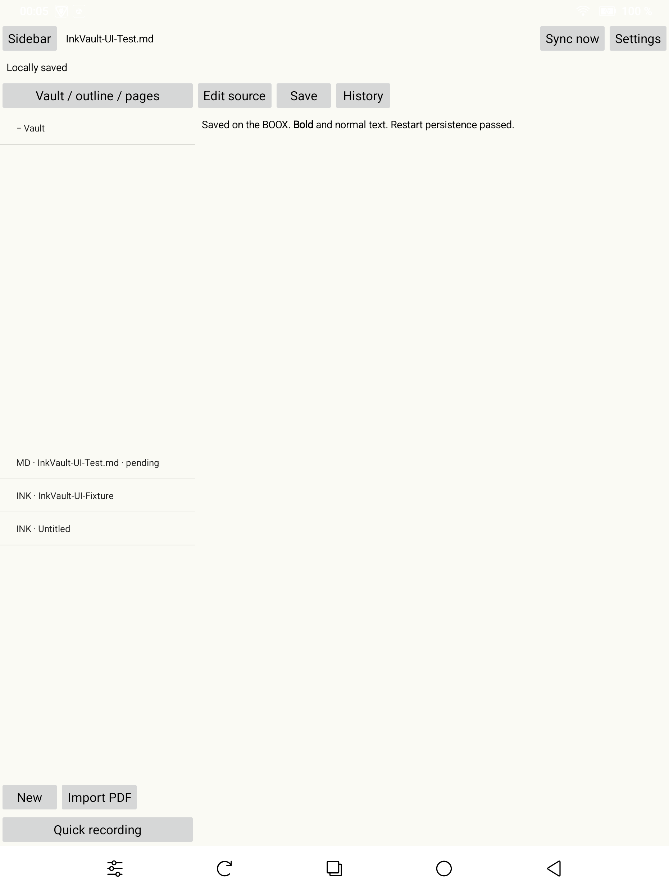
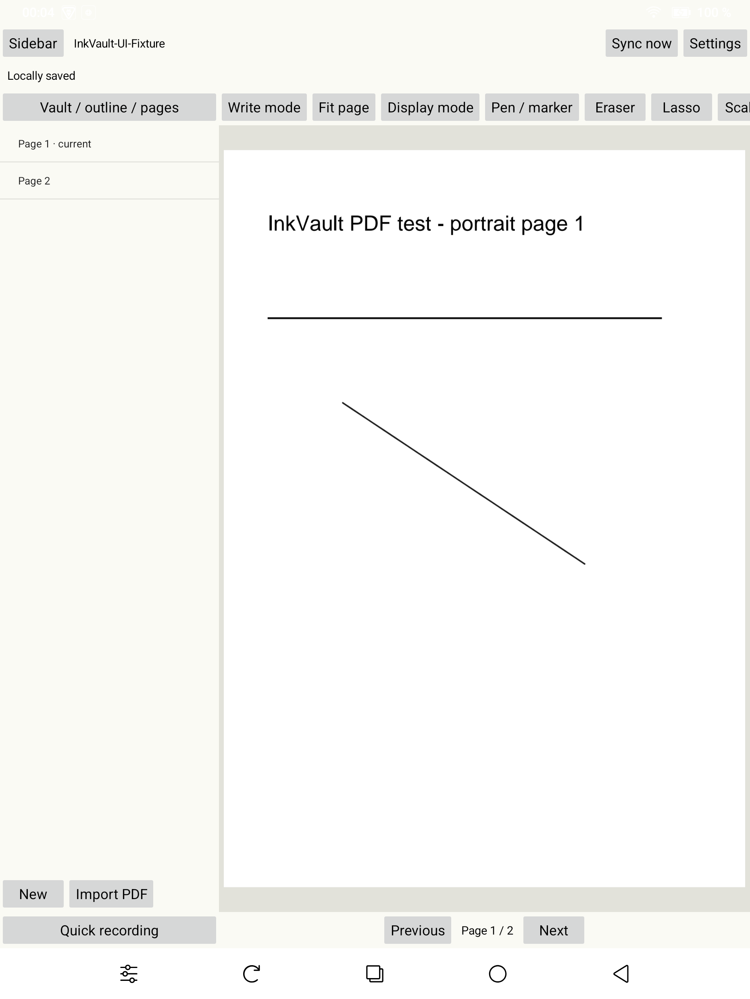
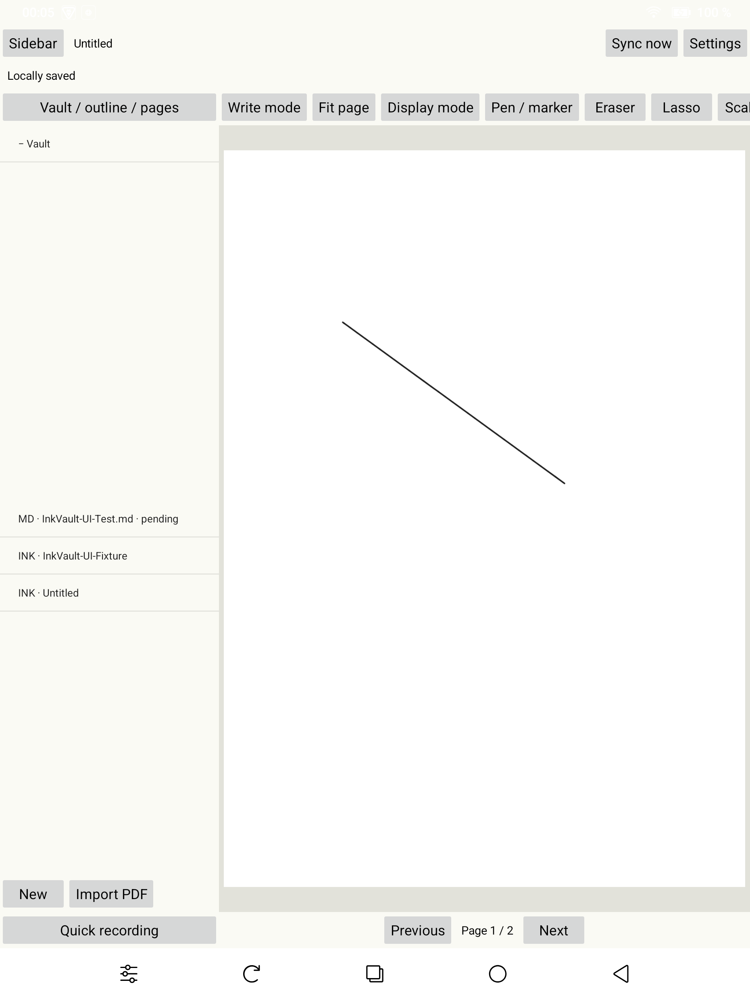

# Unlocked BOOX UI test — 2026-09-07/08

Device: BOOX Note Air 5 C, Android 15. Tested through the actual app UI with
ADB touch/key/stylus input and screenshots. No user documents were changed.

## Passed

- Installed the latest debug APK and opened InkVault. The prior instrumented
  runner had left no installed app. Reinstallation used `-r`, preserving test data.
- Created InkVault-UI-Test.md, typed content, saved and previewed bold Markdown.
  Content remained available after a cold restart and an APK update.
- Created the A4 handwritten note Untitled, drew an injected stylus line, confirmed
  finger input and read-mode stylus input did not add ink, erased the line, and
  restored it with Undo. Added a landscape second page and used page navigation.
- Imported the self-generated two-page InkVault-UI-Fixture.pdf via the Android
  file picker; both portrait and landscape pages rendered. Annotated the original
  background and verified the stroke remained after changing pages and returning.
- Cold-restarted the app and reopened Untitled: the saved line and two pages remained.
- Sidebar toggle expanded the canvas and restored navigation.
- No new crash appeared during this test. The crash buffer contained an older
  22:05 WorkManager initialization failure from an earlier build, already fixed.

## Fixed during testing

Markdown Preview left the BOOX keyboard covering bottom controls. Opening another
view now dismisses the editor's input method and clears its focus before removing
it. Rebuilt and installed the fix, then verified Preview exposed the bottom
controls with no keyboard overlay. Debug build, ktlint, lint and all 12 JVM tests
passed after this change.

## Limits

This is an interactive smoke test, not full product acceptance. Injected stylus
input verifies tool routing but cannot establish physical pen latency, palm
rejection while writing, pressure feel, or e-ink ghosting. Screenshots capture
Android's framebuffer rather than the physical display. Live synchronization,
login, server conflicts, audio recording/playback, image/template placement and
large-vault performance were not exercised in this run. No server is configured
in this installation. Earlier automated server/device tests remain documented
in INKVAULT_IMPLEMENTATION.md.

Observed cold launch: 993 ms on the final restart. Small-workspace memory snapshot:
139499 KiB PSS (about 136 MiB), zero WebViews; this is not a large-vault profile.

The app remains installed and open. Created test data is retained for inspection:
InkVault-UI-Test.md, Untitled (two handwritten pages), and InkVault-UI-Fixture
(annotation source plus imported PDF). The PDF fixture is also in Downloads.

## Screenshots

## Compact controls revision

Installed the revised InkVault APK with the compact black header, grouped editor
controls, single-row folder/file headings, and recent recordings. See
[the tablet capture](compact-header-and-tools.png); the final build additionally
keeps long recording filenames to one line.

- Debug build, 14 JVM tests, lint, and ktlint pass.
- All 10 device tests passed after the layout changes.
- The final targeted activity-launch test also passed with last-open-file
  restoration, header tab placement, collapse/expand, and heading row assertions.
- Playback controls and completion badge are implemented; audible playback and
  completion against a configured live sync server were not exercised here.
- Existing tablet notes were retained; no physical pen-latency acceptance is claimed.

## Divider, alignment, and crash regression

[Tablet capture](aligned-sidebar-divider.png) confirms a continuous black right
sidebar border and the pen controls aligned with the document edge. InkVault's
launcher icon now uses pure white.

The 02:24:39 SIGABRT occurred in MotionEvent.getToolType on a background thread.
The BOOX SDK captures input events asynchronously; the bridge now transfers
independent events and does not recycle those copies before SDK completion.
A 120-stroke recycling/GC stress test passes with confirmed SDK callbacks,
including alternating normal and calibrated pressure. The earlier 11-test suite
and final JVM/build/lint/ktlint checks pass. No new native crash appeared during
this verification; extended physical-writing stability remains to be observed.

The Calendar, Todos, and Files white-icon APKs built, but their installation was
rejected because the installed apps use a different signing key. Their data and
installed versions were preserved; matching signing configuration is required.

## Direct native submission

Removed the SDK's asynchronous per-point queue. The installed build submits
points directly using EpdController while keeping Android live preview.
All 11 device tests passed; 120 strokes / 360 native submissions were retained.
The initial maximum submission timing of 0.446458 ms was invalid evidence of
firmware drawing: the subsequent probe below found those wrappers were no-ops.
Build, 14 JVM tests, lint and ktlint passed, but physical latency was not verified.

## Active tools and firmware compatibility correction

The selected pen, eraser, lasso, and shape tool now have a black background with
white symbols. Selecting a pen and tapping it again opens the same settings
popover as a long press. The selected pen is visible in [this capture](active-tool.png);
the UI hierarchy confirmed all four settings rows after tapping that selected pen.
The subsequent framebuffer capture omitted the popup, so it is not offered as
visual proof of the popup.

An on-device SDK probe found the vendor moveTo/quadTo bindings were null because
Android hidden-API filtering hid android.onyx methods. Earlier direct-call timing
therefore measured silent no-op wrappers. App startup now uses LSPass 6.1 with
only the Landroid/onyx/ namespace exemption, before SDK initialization. No system
settings, root access, or target-SDK downgrade are used. The bridge refuses native
activation if compatibility initialization fails. The dependency's Apache 2.0
license and attribution are packaged in the app.

The installed build resolves the actual firmware methods. All 12 device tests,
14 JVM tests, lint and ktlint pass. The stress test retained 120 strokes and
360 submissions; the maximum real submission call was 8.091198 ms. This measures
API overhead, not pencil-to-visible-ink latency. Physical comparison against
BOOX Notes remains outstanding. Existing notes and recordings were retained.
